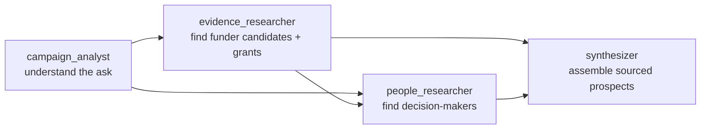

# Funder Scout

**Tell us what you're trying to fund. Our agents find who is most likely to fund it — and show you why.**

## The problem

Small nonprofits lose grant money to research capacity, not merit. A
one-person development shop can't spend forty hours a week reading Form
990-PFs, grants.gov listings, and foundation annual reports to find the
handful of funders who actually give to their cause, in their geography, at
their grant size. Generic donor databases return hundreds of "matches" with
no evidence attached, so staff still have to verify every one by hand before
they can trust it enough to ask for money.

## The solution

Funder Scout takes a nonprofit's mission, campaign, and funding goal and
returns a short list of institutional funders — each one backed by cited,
verifiable public evidence, not a model's guess. Every claim ("this
foundation funds water access in this region," "this funder gave $40k to a
comparable nonprofit last year") links back to an exact passage from a real
page: an IRS filing, a Grants.gov opportunity, a USAspending award, or the
funder's own site. If the evidence doesn't hold up, the claim — or the whole
candidate — is dropped rather than shown as a guess.

## Why it's agentic, not just "an LLM call"

Under the hood is a bounded **Strands** multi-agent graph running on **Amazon
Bedrock**, with four specialized agents handing work off to each other:

- **campaign_analyst** turns the nonprofit's raw inputs into a compact
  research brief — cause, geography, intervention, disqualifiers.
- **evidence_researcher** works only from fetched public pages and
  structured provider data (ProPublica Nonprofit Explorer, Grants.gov,
  USAspending) to identify real institutional funders with real evidence,
  not donor-list mentions.
- **people_researcher** takes the *verified* funder candidates from
  `evidence_researcher` and looks for the program officers, grants staff,
  and trustees a nonprofit would actually reach out to — so a prospect isn't
  just a name, it's a warm path in.
- **synthesizer** assembles everything into a schema-bound JSON envelope,
  citing an exact application-owned source ID for every fact.

None of these agents is allowed to invent a fact. Every citation is
independently re-verified against the actual fetched page text after the
model responds — if a quoted excerpt doesn't anchor to real text, the claim,
grant, or person it supports is deleted before it ever reaches a user. And
critically: **the agents don't score anything.** They emit normalized 0–1
evidence signals (cause alignment, historical giving, geographic fit, grant
size fit, recency, relationship strength); a deterministic Laravel service
applies fixed, disclosed weights to produce the final Fit Score. An LLM
can't quietly inflate a number to make a bad prospect look good.

## What a nonprofit actually sees

- A ranked list of funder prospects, each with a **Fit Score** and the
  evidence behind it — no black box.
- Grant history, when it's independently verified from a filing or award
  record, not asserted by the model.
- Named decision-makers to contact, sourced to a real public page — plus
  optional HubSpot CRM cross-referencing to surface a contact your
  organization may already know.
- A path-to-money view: what's already known, what's still an unknown, and
  the next concrete action to resolve it.
- Every prospect that *didn't* make the cut, with the reason it was
  excluded, so the process is auditable rather than a mystery.

## Built for trust, not just for the demo

- **Fail closed.** If evidence can't be verified, the run reports fewer
  prospects rather than substituting a plausible-sounding guess.
- **Deterministic scoring.** Fit Score weights are fixed application code —
  cause 30%, comparable giving 20%, geography 15%, grant size 15%, recency
  10%, relationships 10%.
- **Provenance gates everywhere.** Source IDs are application-owned, not
  model-owned; excerpts are re-anchored to source text; unresolved claim,
  grant, or person references are stripped before persistence.
- **Clear separation of concerns.** Laravel owns the product, the database,
  auth, and scoring. FastAPI + Strands own AI orchestration only. There is
  exactly one agent framework in the system.

## Stack

- **Laravel 13 / Blade** — workspace, campaigns, research runs, scoring, UI
- **FastAPI + Pydantic** — typed contracts, evidence verification, tool layer
- **Strands Agents on Amazon Bedrock** — the bounded four-node research graph
- **PostgreSQL** — source of truth (SQLite for zero-setup local demo)
- **HubSpot API (optional)** — CRM contact cross-referencing

## Where this goes next

- License Candid/Foundation Directory data for deeper historical grant
  amounts than free public sources can provide.
- Parse PDF-only grant guidelines so eligibility isn't limited to structured
  data.
- Multi-tenant auth and per-domain crawl scheduling for production
  deployment.
- Feed user feedback on prospects back into future ranking.

See [README.md](README.md) for setup instructions and
[KNOWN_LIMITATIONS.md](KNOWN_LIMITATIONS.md) for the full, honest list of
what isn't production-ready yet — we'd rather a judge read that from us than
discover it themselves.
