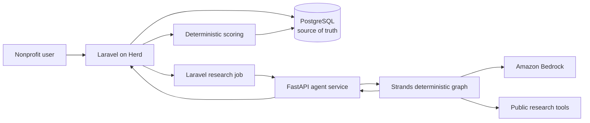

# Funder Scout

**Team:** Brett and Franklin Loeb ([@numberwonderman](https://github.com/numberwonderman)) — Agents for Humans Hackathon entry.

> Current status: validated organization-scoped workspace build. See [KNOWN_LIMITATIONS.md](KNOWN_LIMITATIONS.md) before deployment.

> Tell us what you are trying to fund. Our agents find who is most likely to
> fund it—and show you why.

Funder Scout is a hackathon MVP for nonprofit fundraising intelligence. A
nonprofit submits its website, campaign, and goal. A bounded Strands research
graph works backward from comparable nonprofits to institutional funders,
verifies material claims, and returns inspectable prospect cards. Laravel—not
the model—calculates each Fit Score.

All fixture organizations and sources are fictional and visibly marked as demo
data. They must never be represented as live research.

## Architecture



Laravel owns the product workflow, normalized records, queue lifecycle,
authentication boundary, deterministic ranking, and UI. FastAPI owns all AI
behavior, Pydantic contracts, domain research tools, and Strands orchestration.
There is no second agent framework.

The graph is deliberately predictable:

```text
Nonprofit analysis → Funder and evidence research → Verified synthesis
```

Agents return evidence and normalized score signals in the range 0–1. The PHP
`FitScoreService` applies fixed weights: cause 30, comparable giving 20,
geography 15, grant size 15, recency 10, and relationships 10. An LLM cannot
set or override the final score.

## Repository

- `laravel-app/` — Laravel 13 application and Blade interface
- `agent-service/` — FastAPI, Pydantic schemas, fixture tools, Strands graph
- `herd.yml` — reproducible Herd site/service intent

## Quick demo setup

Prerequisites: Laravel Herd with PHP 8.4 and Composer, PostgreSQL for the target
architecture, and Python 3.11+. This checkout includes a local Python 3.12
environment when installed by the builder; recreate it on another machine:

```bash
cd agent-service
python3.12 -m venv .venv
source .venv/bin/activate
pip install -e '.[dev]'
cp .env.example .env
uvicorn app.main:app --reload --port 8008
```

In another terminal:

```bash
cd laravel-app
composer install
cp .env.example .env
php artisan key:generate
php artisan migrate
php artisan serve
```

Open `http://127.0.0.1:8000`. Herd users may link the `laravel-app` directory
and use the Herd URL instead. The checked-in defaults use Laravel's synchronous
queue driver for maximum demo reliability while still executing the real queued
job. Set `QUEUE_CONNECTION=database` and run `php artisan queue:work` to show an
asynchronous progress screen.

Create the first account at `http://127.0.0.1:8000/register`. Registration
creates an organization workspace, and all campaigns, research runs, prospects,
feedback, enrichment, and metrics are isolated to that organization.

For the quickest durable local launch from the repository root, run
`./start-demo.sh`. It starts both required services, waits for their health
checks, and writes diagnostics under `work/runtime/`. Run `./stop-demo.sh` when
finished.

SQLite is the zero-setup smoke-test default. PostgreSQL is the intended source
of truth. For PostgreSQL set:

```dotenv
DB_CONNECTION=pgsql
DB_HOST=127.0.0.1
DB_PORT=5432
DB_DATABASE=funder_scout
DB_USERNAME=postgres
DB_PASSWORD=
```

Redis is optional and only useful for queue/cache throughput. If used, choose
`QUEUE_CONNECTION=redis`; it is not required for the MVP.

## Bedrock and live mode

Demo mode is on by default and requires no AWS account or public APIs:

```dotenv
DEMO_MODE=true
AGENT_SERVICE_SECRET=local-demo-secret
BEDROCK_MODEL_ID=us.amazon.nova-lite-v1:0
AWS_REGION=us-east-1
# AWS_PROFILE=your-profile
```

The same `AGENT_SERVICE_SECRET` must exist in both services. `/research` uses a
constant-time comparison for this shared internal secret. Never commit AWS or
provider credentials.

The project constructs a bounded Strands graph backed by an Amazon
Bedrock model for live mode. Live mode executes that graph with safe public-page
fetching and ProPublica Nonprofit Explorer search/profile tools. The final
synthesizer is schema-bound and rejects missing evidence. Copy
`laravel-app/.env.production.example`, set `DEMO_MODE=false`, and configure AWS
credentials on the agent-service host. Candid remains an optional future adapter.
The service exposes `/ready` so deployment checks fail when live mode lacks AWS
credentials.

## Tests

```bash
cd laravel-app && php artisan test
cd agent-service && .venv/bin/pytest
```

Tests cover the score formula and boundaries, request authentication, typed
schemas, source enforcement, the fixture graph, Laravel job/client integration,
and normalized result ingestion.

## Failure behavior and data safety

- Every factual claim is rejected unless it has at least one source.
- The response correlation UUID must match the Laravel research run.
- Partial areas can remain empty without losing otherwise valid prospects.
- Missing relationships say “No verified warm relationship identified.”
- External failures never silently fall back to data labeled as live.
- Only legitimate public or authorized sources should be integrated. Do not
  bypass authentication, evade anti-bot controls, or collect private contact
  details.

If a run fails, confirm FastAPI is healthy at `http://127.0.0.1:8008/health`,
the shared secrets match, and—when using a non-sync queue—a worker is running.
